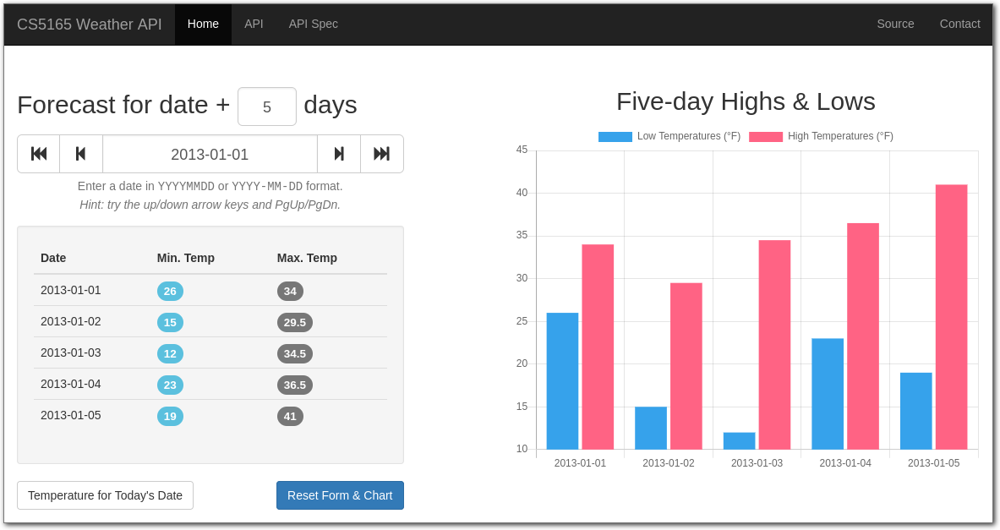

# 17SS_CS5165 Weather API
CS5165 Homework #2 - Weather REST API

[](img/screenshot.png)

~~[Live server](http://cs5165ernstki.ddns.net)~~ | 
[API specification](http://docs.cs5165weatherapi.apiary.io)
([Apiary Blueprint][apiarybp] format, with interactive console)

## System Requirements

* Python 3.x (tested with 3.12)
* [pip][]
* [npm][] (web assets are managed with [Bower][])

Virtualenv and pip should part of most standard Python kits. Try typing
`virtualenv --help` or `pip --help` at the command line to see if they're
already installed on your system.

The `npm` command usually comes with Node.js package; sometimes the binary
package in your distro's "contrib" repository are okay. You would need to
install Bower with `npm install bower` (possibly with the `-g` option) before
continuing, otherwise the web application won't work.

### Docker image

A [Docker image][img] is available so you don't have to install anything
(except [Docker][]).

<abbr title="31 March 2017">As of this writing</abbr>, there are official
desktop clients for [OS X / macOS][docker-mac] and [Windows][docker-win];
the older Docker Toolbox for Mac might work OK, too. Use your distro's
package manager to install the [appropriate package][docker-pkgs] if you use
GNU/Linux.

For installation details, see the "[Docker image installation](#docker-image-installation)" 
section below.

## Installation

1. Clone (or download) this repository and generate a fresh virtual
   environment:

    ```
    # replace <githost> with either github.com or github.uc.edu
    git clone git@<githost>:ernstki/cs5165-weather-api.git

    # change into the repository's base directory
    cd cs5165-weather-api

    # create a virtual environment, into which you'll install all the
    # dependencies for this project
    virtualenv venv

    # on Windows, do 'venv\scripts\activate.cmd' (I think)
    source venv/bin/activate
    ```

2. Install necessary Python packages using `pip`:

    ```
    pip install --editable .

    # this would also work:
    #   $ pip install -r requirements.txt
    ```

3. Install JavaScript and CSS dependencies with Bower:

    ```
    bower install
    ```

4. Launch the Flask web application:

    ```
    # on Windows, do 'set FLASK_APP=weatherapi\api.py' (note the backslash)
    export FLASK_DEBUG=1
    export FLASK_APP=weatherapi/api.py
    flask run  # defaults to http://127.0.0.1:5000
    ```

    If you install [autoenv] on a Unix system (OS X / macOS is Unix), you don't
    have to set `FLASK_APP`, it's done for you automatically when you enter the
    directory.

    If you're running the Flask application within a VirtualBox VM, you'll want
    to be sure that the app runs on 0.0.0.0, so that the VirtualBox port
    forwarding works correctly. You can launch the app with command line flags
    to achieve that:

    ```
    flask run --host=0.0.0.0  # optionally: --port=5000
    ```

### Docker image installation

This requires that you have either the desktop client for [Mac][docker-mac] or
[Windows][docker-win] installed. On GNU/Linux, use your distro's package
manager to install the [appropriate binary package][docker-pkgs].

Then issue these commands at the command prompt:

```bash
git clone https://github.com/ernstki/cs5165-weather-api.git
cd cs5165-weather-api
docker build -t weatherapi .
docker run --rm weatherapi
```

...and visit the displayed URL(s) in your browser until you find one that
worked. Press **Ctrl + C** three times to stop the web server (and delete the
Docker container).

## Running automated tests

The automated tests cover only the requirements of the assignment, and don't
check any aspect of the web front-end.

```
flask test

# alternatively, prettier:
pip install pytest
pytest tests
```

## Other tips

### Testing the API with [Postman][]

You can use [Postman][] to test requests to the API. The included
[`postman_collection_v1.json`](postman_collection_v1.json) may be imported
through the Postman user interface, and includes some example queries.

## Credits
Incorporates [Glyphicons][] and [Bootstrap][] CSS / JS source files, both
under the terms of the MIT license ([ref1][glyphlicense], [ref2][bslicense]).

&copy;2017 Kevin Ernst, [MIT licensed](LICENSE.txt).

[apiarybp]: https://apiblueprint.org/documentation/specification.html
[autoenv]: https://github.com/kennethreitz/autoenv
[postman]: https://www.getpostman.com/apps
[glyphicons]: https://glyphicons.com/
[bootstrap]: https://getbootstrap.com/
[glyphlicense]: https://glyphicons.com/license/
[bslicense]: https://github.com/twbs/bootstrap/blob/master/LICENSE
[virtualenv]: https://virtualenv.pypa.io/en/stable/
[pip]: https://pip.pypa.io/en/stable/
[npm]: https://docs.npmjs.com/getting-started/installing-node
[bower]: https://bower.io/
[docker]: https://docs.docker.com/
[docker-mac]: https://www.docker.com/docker-mac
[docker-win]: https://www.docker.com/docker-windows
[docker-pkgs]: https://pkgs.org/download/docker
[img]: http://homepages.uc.edu/~ernstki/17SS_CS5165/p01-docker-img.tar.gz 
